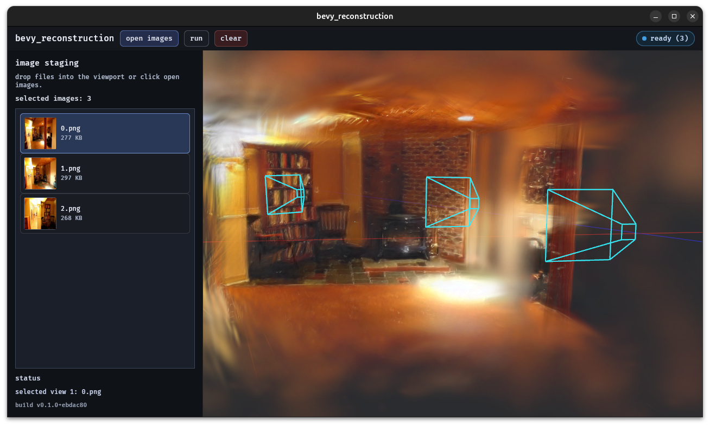

# burn_gaussian_splatting 🔥🌌

[](https://github.com/Mosure/burn_gaussian_splatting/actions?query=workflow%3Atest)
[](https://raw.githubusercontent.com/mosure/burn_gaussian_splatting/main/LICENSE)
[](https://crates.io/crates/burn_gaussian_splatting)


burn feed-forward gaussian splatting





## capabilities

- [x] multi-view -> 3dgs


## runtime defaults

`burn_gaussian_splatting` is productized around one validated inference path:
- WGPU backend
- fusion enabled
- YoNoSplat model loading + image IO enabled

The outer crate API is intentionally constrained to this path.

On first run, if weights are not explicitly provided, the crate auto-downloads them to:
- `~/.burn_gaussian_splatting/models/yono`

Native bootstrap defaults can also be provided programmatically (without env vars) via
`YonoBootstrapConfig`.
Bootstrap download/cache helpers are native-only; on wasm, pass explicit weights and use
`ImageToGaussianPipeline::load` / `load_default`.


## rust API

```rust
use burn_gaussian_splatting::{
    ImageToGaussianPipeline, PipelineConfig, PipelineWeights, PipelineQuality,
};

let (pipeline, _report) = ImageToGaussianPipeline::load_default(
    PipelineConfig {
        quality: PipelineQuality::Balanced,
        image_size: 224,
        ..Default::default()
    },
    PipelineWeights::default_yono_safetensors(),
)?;

let gaussians = pipeline.run_images(&["view0.png", "view1.png"])?;
pipeline.save_glb("outputs/scene.glb", &gaussians, &PipelineQuality::Balanced.export_options())?;
```

Auto-bootstrap weights directly:

```rust
let (pipeline, _report) = ImageToGaussianPipeline::load_default_bootstrapped(
    PipelineConfig::default(),
    burn_gaussian_splatting::YonoWeightFormat::Safetensors,
)?;
```

Programmatic bootstrap config (native):

```rust
use burn_gaussian_splatting::{YonoBootstrapConfig, YonoWeightFormat, PipelineWeights};

let bootstrap = YonoBootstrapConfig {
    model_base_url: "https://aberration.technology/model".into(),
    yono_remote_root: "YoNoSplat".into(),
    ..Default::default()
};
let weights = PipelineWeights::resolve_or_bootstrap_yono_with_config(
    YonoWeightFormat::Burnpack,
    &bootstrap,
)?;
```


## CLI usage

Install:

```bash
cargo install --path . --features cli --bin splat_glb
```

Run:

```bash
splat_glb \
  --images view0.png view1.png \
  --output outputs/gaussians.glb \
  --image-size 224 \
  --weights-format safetensors \
  --quality balanced \
  --profile
```

This exports a GLB with `KHR_gaussian_splatting` extension metadata and gaussian attributes.
When `--backbone-weights`/`--head-weights` are omitted, weights are loaded from cache and downloaded if missing.
You can override export policy with:
- `--max-gaussians`
- `--opacity-threshold`
- `--sort-mode {opacity|index}`
- `--weights-format {safetensors|bpk}`

Quality presets:
- `fast`: lower gaussian budget, quick outputs.
- `balanced`: default quality/perf tradeoff.
- `high`: full gaussian export

Bootstrap environment overrides:
- `BURN_GAUSSIAN_SPLATTING_CACHE_DIR`
- `BURN_GAUSSIAN_SPLATTING_MODEL_BASE_URL`
- `BURN_GAUSSIAN_SPLATTING_YONO_REMOTE_ROOT`
- `BURN_GAUSSIAN_SPLATTING_YONO_BACKBONE_URL`
- `BURN_GAUSSIAN_SPLATTING_YONO_HEAD_URL`


## import to burnpack

Convert safetensors to `.bpk` for faster loads and fewer runtime deps:

```bash
cargo run --features cli --bin import -- \
  --component both \
  --format bpk
```

## web app

Build wasm + bindgen:

```bash
./scripts/build_web.sh
```

Run local preview:

```bash
python3 -m http.server 4173 -d www
```

Open:

```text
http://127.0.0.1:4173/index.html
```

Web e2e test:

```bash
./tests/web_playwright/run.sh
```

The web page supports:
- multi-image upload (`png`/`jpg`/`webp`)
- browser-side GLB export with `KHR_gaussian_splatting`
- download link for manual inspection
- service-worker caching for wasm/web assets and model-file patterns (`*.bpk`, parts manifests, parts)

Current web inference uses a lightweight browser-side multi-view splat synthesis path to keep
startup/runtime practical in wasm environments.


## license
licensed under either of

 - Apache License, Version 2.0 (http://www.apache.org/licenses/LICENSE-2.0)
 - MIT license (http://opensource.org/licenses/MIT)

at your option.
